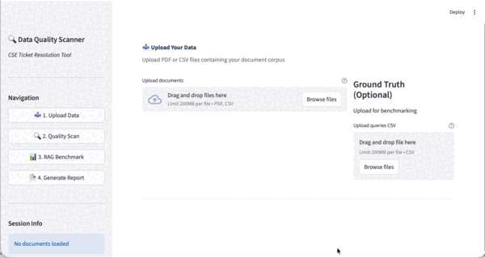
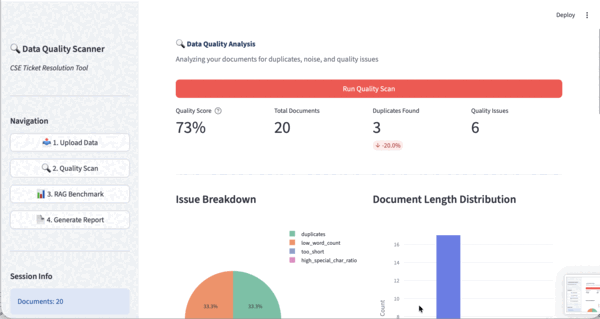
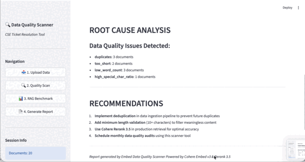

# Embed Data Quality Scanner

**A diagnostic tool for RAG data quality issues and search accuracy improvement**

[](https://python.org)
[](https://streamlit.io)
[](https://cohere.com)

---

## Overview

Data quality issues in RAG (Retrieval-Augmented Generation) systems are a major cause of decreased search accuracy. This tool automatically detects and cleans **duplicate content, noise, and quality issues** in your document data to improve retrieval performance.

### Key Features

| Feature | Description |
|---------|-------------|
| **Quality Scan** | Embedding-based duplicate detection + text quality analysis |
| **Auto Cleaning** | Automatic removal of problematic documents (configurable strategy) |
| **Benchmark** | Before/After search performance comparison |
| **Report** | Generate Markdown analysis reports |

---

## Demo

### Step 1: Upload Data
Upload your PDF or CSV documents and ground truth queries.



---

### Step 2: Quality Scan
Run quality scan to detect duplicates and analyze text quality.


---

### Step 3: RAG Benchmark
Compare retrieval performance before and after data cleaning.



---

### Step 4: Generate Report
Download the analysis report in Markdown format.



---

## Quick Start

### 1. Install Dependencies

```bash
pip install -r requirements.txt
```

### 2. Configure API Keys

```bash
cp .env.example .env
```

Edit `.env` file:
```env
COHERE_API_KEY=your-cohere-api-key
PINECONE_API_KEY=your-pinecone-api-key
```

### 3. Run Application

```bash
python -m streamlit run src/main.py
```

Open http://localhost:8501 in your browser

---

## Usage

### Step 1: Upload Data

- **Document files**: Upload PDF or CSV
- **Ground Truth**: Query CSV for benchmarking (optional)

```csv
# documents.csv format
id,text,category
doc_001,"RAG is a technique that augments LLM responses...",AI
```

```csv
# ground_truth.csv format
query_id,query,relevant_doc_ids
q001,"What is RAG?","doc_001,doc_006"
```

### Step 2: Quality Scan

Click "Run Quality Scan" to:
1. Generate document embeddings with Cohere Embed v3
2. Detect duplicates using cosine similarity
3. Analyze text quality (length, special characters, etc.)
4. Perform automatic cleaning

### Step 3: RAG Benchmark

Click "Run Benchmark" to:
- Compare original vs cleaned data performance
- Measure NDCG@10, Hit Rate@10
- Evaluate Cohere Rerank effectiveness

### Step 4: Generate Report

Download analysis results as Markdown

---

## Project Structure

```
P01_CSE_RAG/
├── src/
│   ├── main.py              # Streamlit app
│   ├── embeddings/
│   │   └── cohere_client.py # Cohere API client
│   ├── vectordb/
│   │   └── pinecone_client.py # Pinecone client
│   ├── scanner/
│   │   ├── scanner.py       # Scan orchestrator
│   │   ├── noise_detector.py # Duplicate detection
│   │   ├── text_analyzer.py  # Text analysis
│   │   └── cleaner.py       # Data cleaning
│   ├── evaluator/
│   │   ├── evaluator.py     # RAG evaluation
│   │   ├── metrics.py       # NDCG, MRR, etc.
│   │   └── reranker.py      # Cohere Rerank
│   ├── ingest/
│   │   ├── csv_loader.py    # CSV loader
│   │   ├── pdf_parser.py    # PDF parser
│   │   └── chunker.py       # Text chunking
│   └── report/
│       └── generator.py     # Report generation
├── config/
│   ├── settings.py          # Configuration
│   └── logging_config.py    # Logging config
├── data/
│   └── sample/              # Sample data
├── docs/
│   └── screenshots/         # Demo screenshots
├── .env.example             # Environment variables template
└── requirements.txt         # Dependencies
```

---

## System Architecture

```
┌─────────────────────────────────────────────────────────┐
│                    STREAMLIT UI                         │
│  Upload → Scan → Benchmark → Report                     │
└─────────────────────────────────────────────────────────┘
                         │
         ┌───────────────┼───────────────┐
         ▼               ▼               ▼
    ┌─────────┐    ┌─────────┐    ┌─────────────┐
    │ SCANNER │    │ INGEST  │    │  EVALUATOR  │
    │─────────│    │─────────│    │─────────────│
    │ Noise   │    │ CSV     │    │ NDCG        │
    │ Detector│    │ PDF     │    │ Rerank      │
    │ Cleaner │    │ Chunk   │    │ Comparison  │
    └─────────┘    └─────────┘    └─────────────┘
         │               │               │
         └───────────────┴───────────────┘
                         │
         ┌───────────────┴───────────────┐
         ▼                               ▼
    ┌─────────────┐              ┌─────────────┐
    │   COHERE    │              │  PINECONE   │
    │ Embed v3    │              │ Vector DB   │
    │ Rerank 3.5  │              │ Namespace   │
    └─────────────┘              └─────────────┘
```

---

## Performance Results

| Metric | Before | After | Improvement |
|--------|--------|-------|-------------|
| NDCG@10 | 31.22% | 88.42% | **+183.2%** |
| Hit Rate@10 | 80% | 100% | **+25%** |
| Documents | 20 | 15 | -5 (cleaned) |

---

## Configuration

### Sidebar Settings

| Option | Default | Description |
|--------|---------|-------------|
| Duplicate Threshold | 0.92 | Similarity threshold for duplicate detection |
| Cleaning Strategy | MODERATE | Cleaning aggressiveness level |

### Cleaning Strategies

| Strategy | Target |
|----------|--------|
| CONSERVATIVE | Exact duplicates only |
| MODERATE | Duplicates + short docs + high special char ratio |
| AGGRESSIVE | All above + low quality documents |

---

## Required APIs

| Service | Purpose | Free Tier |
|---------|---------|-----------|
| [Cohere](https://dashboard.cohere.com) | Embedding & Rerank | Available |
| [Pinecone](https://app.pinecone.io) | Vector DB | Starter plan |

---

## Use Cases

### 1. CSE Ticket Resolution
Diagnose root causes of RAG chatbot accuracy issues and provide solutions

### 2. Data Pipeline Validation
Detect quality issues before data reaches production to ensure data quality

### 3. RAG Performance Benchmarking
Quantitatively compare effects of different preprocessing strategies

---

## Tech Stack

- **Frontend**: Streamlit, Plotly
- **Embedding**: Cohere Embed v3
- **Reranking**: Cohere Rerank 3.5
- **Vector DB**: Pinecone Serverless
- **PDF Processing**: PyMuPDF (fitz)

---

## License

MIT License

---

## Contributing

Issues and Pull Requests are welcome!
